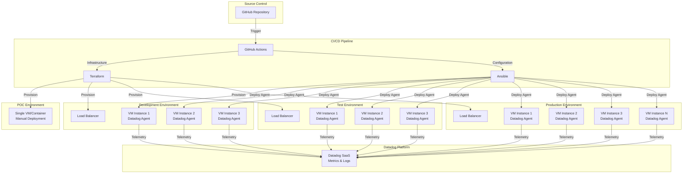
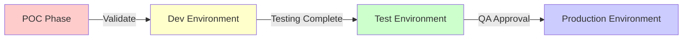
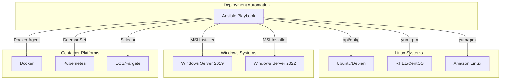

# Datadog Agent Deployment Architecture

## High-Level Architecture Diagram

## Deployment Flow

## Multi-Tech Stack Support

## Key Architecture Components

### 1. Infrastructure as Code (Terraform)
- **Purpose**: Provision compute resources across environments
- **Scalability**: Environment-specific variable files
- **Consistency**: Same codebase for all environments

### 2. Configuration Management (Ansible)
- **Purpose**: Deploy and configure Datadog agents
- **Flexibility**: Role-based architecture supports multiple OS types
- **Idempotent**: Safe to run multiple times

### 3. CI/CD Pipeline (GitHub Actions)
- **Automation**: Triggered on code commits
- **Approval Gates**: Manual approval required for production
- **Rollback**: Previous versions tagged for easy rollback

### 4. Multi-Environment Strategy
| Environment | Purpose | Approval | Monitoring |
|-------------|---------|----------|------------|
| POC | Initial validation | None | Basic |
| Dev | Development testing | Auto | Standard |
| Test | QA validation | Team Lead | Enhanced |
| Production | Live workloads | Change Board | Full |

## Security Considerations

1. **API Key Management**: Stored in secure vaults (GitHub Secrets, HashiCorp Vault)
2. **Network Segmentation**: Agents communicate outbound only to Datadog
3. **RBAC**: Role-based access for deployments
4. **Audit Trail**: All deployments logged and tracked
