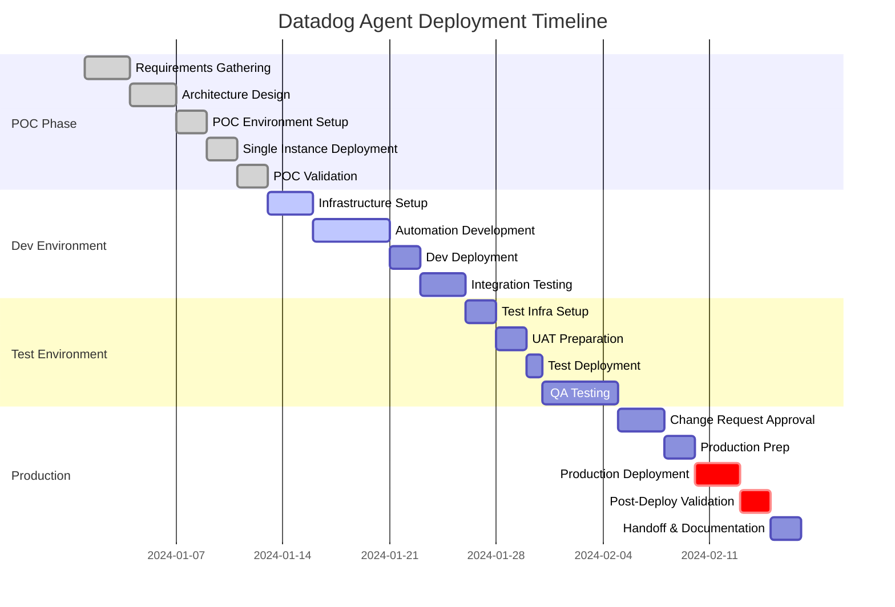

# Datadog Agent Deployment - Project Plan

## Executive Summary

This document outlines the comprehensive project plan for deploying the Datadog agent across multiple environments and tech stacks. The deployment follows a phased approach from Proof of Concept (POC) through Development, Test, and Production environments.

## Project Objectives

1. **Scalable Deployment**: Create a repeatable, automated deployment process
2. **Multi-Environment Support**: Deploy across Dev, Test, and Production environments
3. **Cross-Platform Compatibility**: Support Linux, Windows, and container platforms
4. **Minimal Downtime**: Implement rolling deployments for production
5. **Comprehensive Monitoring**: Ensure full observability from day one

## Project Timeline

## Detailed Timeline

### Week 1-2: POC Phase (12 days)
**Objective**: Validate the deployment approach with a single instance

| Day | Activity | Owner | Deliverable |
|-----|----------|-------|-------------|
| 1-3 | Requirements gathering and stakeholder alignment | PM | Requirements doc |
| 4-6 | Architecture design and tool selection | Solutions Architect | Architecture diagram |
| 7-8 | POC environment provisioning | DevOps Engineer | Single VM/Container |
| 9-10 | Manual agent deployment and configuration | Implementation Engineer | Working agent |
| 11-12 | POC validation and stakeholder demo | Team | Sign-off |

### Week 3-4: Development Environment (13 days)
**Objective**: Automate deployment for multiple instances

| Day | Activity | Owner | Deliverable |
|-----|----------|-------|-------------|
| 13-15 | Terraform infrastructure code development | DevOps Engineer | IaC templates |
| 16-20 | Ansible playbook development | Automation Engineer | Deployment automation |
| 21-22 | Deploy to Dev environment (3 instances) | Team | Running environment |
| 23-25 | Integration testing and refinement | QA Engineer | Test report |

### Week 5-6: Test Environment (13 days)
**Objective**: Validate at scale with formal testing

| Day | Activity | Owner | Deliverable |
|-----|----------|-------|-------------|
| 26-27 | Test environment infrastructure setup | DevOps Engineer | Test environment |
| 28-29 | UAT test case preparation | QA Engineer | Test plans |
| 30 | Deploy to Test (5 instances) | Implementation Engineer | Running environment |
| 31-35 | Formal QA testing | QA Team | QA sign-off |

### Week 7-9: Production Deployment (15 days)
**Objective**: Safely deploy to production with minimal risk

| Day | Activity | Owner | Deliverable |
|-----|----------|-------|-------------|
| 36-38 | Change request and approval process | PM | Approved CR |
| 39-40 | Production preparation and runbooks | Team | Deployment runbook |
| 41-43 | Phased production deployment (10 instances) | Implementation Team | Production deployment |
| 44-45 | Post-deployment validation | QA + DevOps | Validation report |
| 46-47 | Knowledge transfer and documentation | Team | Final documentation |

**Total Project Duration**: 47 days (~9-10 weeks)

## Phase Breakdown

### Phase 1: POC (Proof of Concept)

**Duration**: 2 weeks
**Goal**: Validate deployment approach on a single instance

**Activities**:
- Select target platform (AWS/Azure/GCP/On-prem)
- Manual installation of Datadog agent
- Configure basic integrations (system, Apache, logs)
- Validate data flow to Datadog platform
- Document process and lessons learned

**Success Criteria**:
- ✅ Agent successfully installed and reporting
- ✅ Metrics visible in Datadog UI
- ✅ Stakeholder approval to proceed

**Risks**:
- Network connectivity issues
- Firewall restrictions blocking Datadog endpoints
- API key permissions

**Mitigation**:
- Pre-validate network requirements
- Coordinate with security team early
- Test with trial API key first

### Phase 2: Development Environment

**Duration**: 2 weeks
**Goal**: Automate deployment and test with multiple instances

**Activities**:
1. **Infrastructure as Code** (Week 1)
   - Develop Terraform modules for VPC, compute, networking
   - Create environment-specific variable files
   - Implement state management

2. **Configuration Management** (Week 1-2)
   - Create Ansible role for Datadog agent
   - Support multiple OS types (RHEL, Ubuntu, Windows)
   - Implement integration configurations
   - Create inventory management

3. **CI/CD Pipeline** (Week 2)
   - Setup GitHub Actions workflows
   - Implement automated testing
   - Create deployment pipeline

**Success Criteria**:
- ✅ 3+ instances deployed automatically
- ✅ All instances reporting to Datadog
- ✅ Deployment time < 15 minutes
- ✅ Rollback capability tested

**Risks**:
- Terraform state conflicts
- Ansible compatibility issues
- SSH/WinRM connectivity problems

**Mitigation**:
- Use remote state with locking
- Test playbooks on all target OS versions
- Implement bastion/jump host if needed

### Phase 3: Test Environment

**Duration**: 2 weeks
**Goal**: Formal testing and validation at scale

**Activities**:
1. **Environment Setup** (Days 1-2)
   - Deploy 5+ instances
   - Configure load balancing
   - Setup monitoring dashboards

2. **Quality Assurance** (Days 3-10)
   - Execute test plans
   - Performance testing
   - Failover testing
   - Integration validation
   - Documentation review

**Success Criteria**:
- ✅ All test cases passed
- ✅ Performance benchmarks met
- ✅ No critical or high-severity bugs
- ✅ QA team sign-off

**Risks**:
- Deployment failures in larger scale
- Performance degradation
- Integration conflicts

**Mitigation**:
- Gradual scaling approach
- Resource monitoring during deployment
- Fallback to previous version ready

### Phase 4: Production Deployment

**Duration**: 3 weeks
**Goal**: Safe, controlled production rollout

**Activities**:
1. **Pre-Production** (Week 1)
   - Change request submission and approval
   - Stakeholder communication plan
   - Runbook creation and review
   - Rollback plan validation

2. **Deployment** (Week 2)
   - Deploy in batches (rolling deployment)
   - Batch 1: 3 instances (Monitor 24h)
   - Batch 2: 4 instances (Monitor 24h)
   - Batch 3: Remaining instances

3. **Post-Deployment** (Week 3)
   - Monitor for 48 hours
   - Validate all metrics
   - Performance review
   - Team training
   - Documentation finalization

**Success Criteria**:
- ✅ Zero downtime deployment
- ✅ All instances reporting correctly
- ✅ No production incidents
- ✅ Customer/stakeholder approval

**Risks**:
- Production environment differences
- Unexpected failures at scale
- Resource constraints
- Data/metric discrepancies

**Mitigation**:
- Pre-production environment mirror
- Canary deployment approach
- 24/7 on-call coverage during rollout
- Immediate rollback capability

## Teams and Stakeholders

### Core Team

| Role | Responsibilities | Time Commitment |
|------|-----------------|-----------------|
| **Project Manager** | Timeline, stakeholder management, risk tracking | 50% |
| **Solutions Architect** | Architecture design, technical decisions | 30% |
| **DevOps Engineer** | Infrastructure, Terraform, CI/CD | 100% |
| **Automation Engineer** | Ansible development, scripting | 100% |
| **Implementation Engineer** | Deployment execution, troubleshooting | 100% |
| **QA Engineer** | Test planning, execution, validation | 75% |

### Extended Team

| Role | Involvement | Phase |
|------|-------------|-------|
| **Security Team** | Firewall rules, API key management | POC, Dev |
| **Network Team** | Connectivity, routing | POC, Prod |
| **Database Team** | Integration setup (if needed) | Dev, Test |
| **Application Teams** | Coordination, testing | Test, Prod |
| **Change Advisory Board** | Production approval | Prod |

### Stakeholders

- **Executive Sponsor**: Overall project approval and budget
- **Engineering Manager**: Resource allocation and priorities
- **Operations Manager**: Production deployment approval
- **Security Officer**: Security compliance sign-off

## Tools and Technologies

### Infrastructure
- **Terraform**: Infrastructure provisioning
- **AWS/Azure/GCP**: Cloud platform
- **Ansible**: Configuration management

### CI/CD
- **GitHub Actions**: Pipeline automation
- **GitHub**: Version control
- **S3/Blob Storage**: Terraform state

### Monitoring
- **Datadog**: Observability platform
- **Datadog APM**: Application performance monitoring
- **Datadog Logs**: Log aggregation

### Communication
- **Slack**: Team communication
- **Jira**: Project tracking
- **Confluence**: Documentation

## Key Milestones

| # | Milestone | Date | Criteria |
|---|-----------|------|----------|
| 1 | POC Completion | Week 2 | Single instance validated |
| 2 | Automation Complete | Week 4 | Repeatable deployment |
| 3 | Dev Deployment | Week 4 | 3 instances automated |
| 4 | Test QA Sign-off | Week 6 | All tests passed |
| 5 | Production CR Approved | Week 7 | Change board approval |
| 6 | Production Deployment | Week 9 | All instances live |
| 7 | Project Closure | Week 10 | Documentation complete |

## Risk Management

### High-Priority Risks

| Risk | Impact | Probability | Mitigation |
|------|--------|-------------|------------|
| Production deployment failure | High | Medium | Extensive testing, rollback plan |
| Resource availability | High | Medium | Cross-train team members |
| Datadog API limits | Medium | Low | Rate limiting, batch operations |
| Network/firewall issues | High | Medium | Early validation with network team |
| Performance degradation | High | Low | Load testing in Test environment |

### Risk Response Plan

1. **Weekly risk reviews** during team standup
2. **Risk register** updated in project management tool
3. **Escalation path** defined for critical risks
4. **Contingency budget** (10% of total) for unexpected issues

## Success Metrics

### Deployment Metrics
- **Deployment Time**: < 15 minutes per environment
- **Success Rate**: > 99%
- **Rollback Time**: < 5 minutes
- **Automation Coverage**: 100%

### Operational Metrics
- **Agent Uptime**: > 99.9%
- **Data Completeness**: > 99%
- **Alert Response Time**: < 5 minutes
- **Mean Time to Recovery**: < 30 minutes

### Business Metrics
- **Time to Value**: Metrics visible within 5 minutes
- **Team Efficiency**: 80% reduction in manual work
- **Scalability**: Support 10x growth without rework
- **Cost Efficiency**: Predictable, manageable costs

## Communication Plan

### Status Updates
- **Daily Standups**: Team sync (15 min)
- **Weekly Status Reports**: Email to stakeholders
- **Bi-weekly Steering**: Executive review (30 min)

### Escalation Path
1. **Level 1**: Team Lead (Response: 1 hour)
2. **Level 2**: Engineering Manager (Response: 4 hours)
3. **Level 3**: Executive Sponsor (Response: 24 hours)

## Post-Deployment

### Knowledge Transfer
- **Documentation**: Complete runbooks and SOPs
- **Training**: Team training sessions (3 sessions)
- **Handoff**: Operations team enablement

### Continuous Improvement
- **Retrospective**: Lessons learned session
- **Metrics Review**: Monthly review of success metrics
- **Optimization**: Quarterly review of automation

## Appendix

### Change Control Process
1. Submit change request 5 days before deployment
2. Include impact assessment and rollback plan
3. Obtain approvals from CAB
4. Execute during approved maintenance window

### Deployment Checklist
- [ ] Infrastructure provisioned
- [ ] Datadog API key validated
- [ ] Network connectivity verified
- [ ] Ansible inventory updated
- [ ] Backup/snapshot created
- [ ] Monitoring dashboards created
- [ ] Runbook reviewed
- [ ] Team notified
- [ ] Rollback plan validated
- [ ] Post-deployment tests ready
